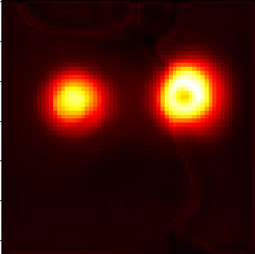
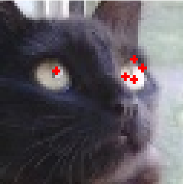

# locating-centers 
Some detection tasks are better represented by dots instead of the traditional bounding boxes. For example, if the image has hundreds-thousands of objects of interest, the objects are very small and the width and height of the object are not needed. Bounding box annotations may also be more expensive and time-consuming to obtain compared to single-point annotations. It is also easy to convert bounding box annotations to single-point annotations by taking the center of the bounding box

This type of detection can be useful for counting crowds or detecting objects that are only a few pixels in diameter like eye pupils or aerial images of crops.

All aspects of this repository like the losses, thresholding function or heatmap functions can easily be extended or modified, and different combinations can be tried out.

## How does it work?
The annotated points in the image are used to make a heatmap. Each point is a Gaussian peak, and the task is to use semantic segmentation to regress the heatmap, then use some thresholding method to convert the heatmap to a set of points. For example:

Image of a cat\
\
Annotated image of a cat with dots denoting eye labels\
\
Ground truth heatmap\
\
Trained U-Net predicts eyes heatmap\
\
Basic thresholding on the prediction\

  
## Basic usage

Very first installation steps: create a conda evironment (this is tested on Python 3.11.5), activate the conda environment and run pip install -r requirements.txt

Train: python -m src.train, and change the train settings in config.json.\
Infer: python -m src.predict, and change the inference settings in config.json

## Making or formatting a dataset  
  
You have two options:

 1. Make your own Dataset class according to your dataset format.
 2. (Recommended) Using the ImagePointDataset class already provided to you, and adapting your current dataset to the requirements/making a new dataset from scratch using the annotator.

### 1. Making your own Dataset class
### 2. (Recommended) Use the current prescribed Dataset architecture

In this case, run python -m annotator.annotate. The path with images to annotate should be set in the "annotate" part of the config. Click on the points and close the image when you are done. The next image will automatically open.

You will then have a dataset that is formatted in a way that can be used immediately with the ImagePointDataset class with no changes.

If you already have a dataset of images and points, you can adapt it to this repository's format in this way:

1. Have individual text files for each image, named after the image. For example, if you have cat_998.png and cat_999.png in a folder directory, you should now also have cat_998.txt and cat_999.txt in this directory.
2. Each txt file should have, for each line, 2 decimal values between 0 and 1. For example: 0.16751217532467527,0.3955064033189033. This is the relative position of a point within the image.

## Making your custom loss function
## Making your custom thresholding function
## Making your custom model
## Making your custom heatmap generator

You can experiment with the way the heatmap is generated and try out new ways of generating a heatmap to see how results change depending on the heatmap.
If you would like to use the Gaussian but with a different sigma value (variance in both directions), then change the gaussian_sigma value in the config.
If you would like to define a new way to generate a heatmap instead, the arguments and returns should be the same as prescribed in the comments of the generate_gaussian_heatmap method in src.dataset.
