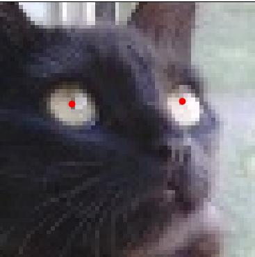

# locating-centers 
Locating an arbitray number of points using heatmap regression. All aspects of this repository like the losses, thresholding function or heatmap functions can easily be extended or modified.
  
## Basic usage
Train: python -m src.train, and change the train settings in config.json.
Infer: python -m src.predict, and change the inference settings in config.json

## How does it work?
The annotated points in the image are used to make a heatmap. Each point is a Gaussian peak, and the task is to use semantic segmentation to regress the heatmap, then use some thresholding method to convert the heatmap to a set of points. For example:

  

## Making or formatting a dataset  
  
You have two options:

 1. Make your own Dataset class according to your dataset format.
 2. Using the ImagePointDataset class already provided to you, and adapting your current dataset to the requirements/making a new dataset from scratch using the annotator.

### 1. Making your own Dataset class
### 2. (Recommended) Use the current prescribed Dataset architecture

## Making your custom loss function
## Making your custom thresholding function
